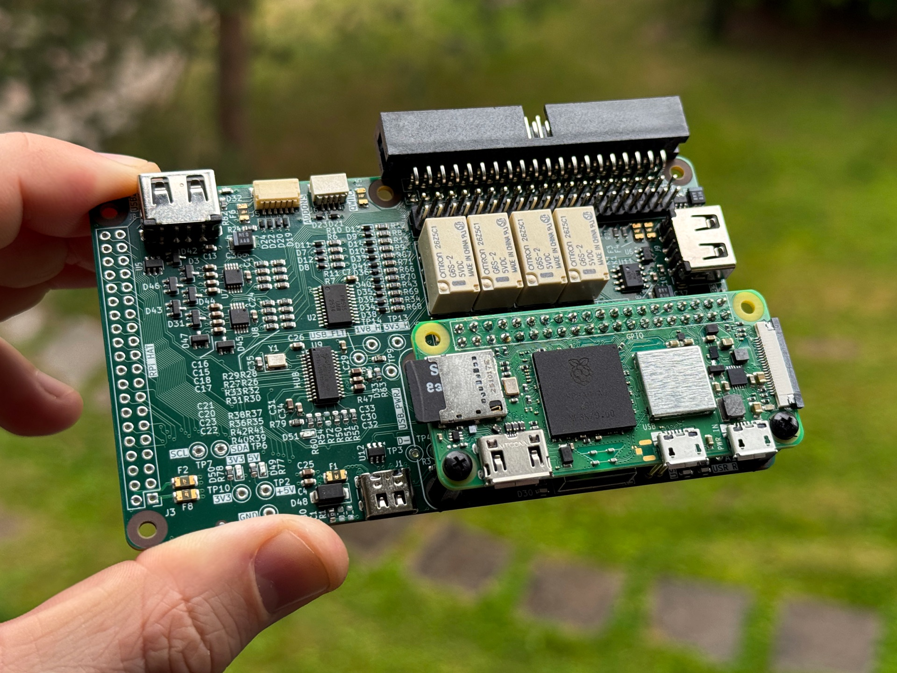

**Pinbot** is an open-source platform for quickly building test jigs for electronics QA. The platform is made up of [mechanical fixture](), control electronics, jig-level software and backend to store all test results.

## Pinbot electronics
This repo is dedicated for electronics of a typical Pinbot jig. At a moment it is a compact carrier board for Raspberry Pi Zero 2. The board also can be used with regular size RPis thru HAT connector (J3).

**It features:**
- 16 channels GPIO (0-24V) thru TCA9535
- 8 channels ADC (12 bit, 0-24V) thru ADS1015
- 4 signal relays
- USB hub
    - 4 downstream ports (3 USB-A + 1 as a pins on J2)
    - Per-port power control
    - Per-port fault signals for error and power failures handling
- Qwiic connector for easy I2C expansion
- Raspberry Pi 40-pin GPIO header with SPI, I2C, UART, etc
- USB-C for power supply
- User leds, test points, basic signal lines protection and more.

Carrier board is 114x65mm to fit perfectly into [Pinbot's chassis](). You can use it as a test engine for a small projects and supply them directly with up to 5V@1A power.

The repo includes KiCAD source files, generated gerbers, BOM, and everything to produce it on your own. Python *library and software examples* are also available and briefly [documented](sw_examples/README.md).

## License
- [GNU GPLv3](https://www.gnu.org/licenses/gpl-3.0.en.html) for **software**: firmware, libraries, generators, tools, examples, etc
- [CERN-OHL-S](https://cern-ohl.web.cern.ch/) for **hardware**: PCB schematic, layout, BOM, gerbers, 3D models, g-codes, etc.
- [CC BY-SA 4.0](https://creativecommons.org/licenses/by-sa/4.0/deed.en) is for docs, pictures, articles, video, assets, etc.

Pinbot projects structure may mix different sources and artifacts — check corresponding dirrectories for `LICENSE` file.

-----------
*This project is sponsored by [NLnet](https://nlnet.nl/) as a part of [NGI Zero Review](https://nlnet.nl/NGI0/review/) program.*

    

